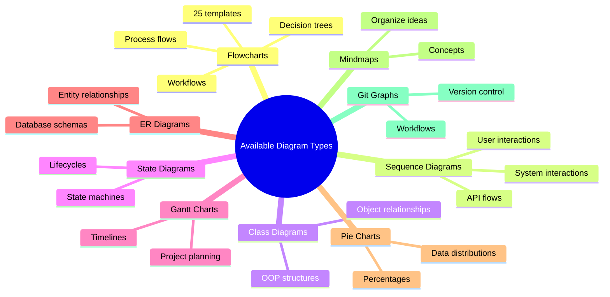

  
  
  <b>Collection of ready-to-use Mermaid diagram templates. Browse, preview, and copy diagram code instantly.</b>

## How to Use

1. **Browse** the templates or use the search bar
2. **Click** on any template to see a larger preview
3. **Copy** the code with the copy button
4. **Paste** into your Mermaid-compatible editor or documentation

## Perfect For

- Documentation writers
- Software developers
- Project managers
- Students and educators
- Anyone who needs quick, professional diagrams

---

Made for anyone who wants to create professional diagrams without starting from scratch.
